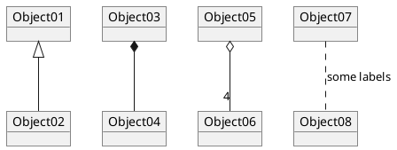

# 001 - Technical Decision: Model Persistence

The concept of *Chronos* as a structured history database implies certain requirements on the model and - indirectly - on how it is persisted.

## Functional requirements to the model

The functional model is intended to be so generic, that all possible constellations and details of a historic entity can be reflected appropriately.

The following concepts must be covered:

### Basic aspects
Each entity inevitably is based on the atomic data
* Technical ID
* Meta Info:
  * Version
  * Creation author / timestamp
  * Last update author / timestamp
* Names
* Datespecs

### Attributes
Entities can have **attributes**. Each **attribute** has a
* *key*, that is defined by 
* *value*

Examples:
* `Role` for **profile** `Person`, with values *king*, *general*, *author*, ...
* `Gender` for **profile** `Person`, with values *female*, *male*, *unknown*
* `Role` for **profile** `Location`: with values *capital*, *empire*, *mythical*, ...

### Relations

### Profiles
Each entity must have exactly one **profile**. **Profiles** not only define the type of an entity, but also a set of constraints on the data it contains. A **profile** can specify rules the for entity's:
* **datespecs**
* **attributes**
* **relations**
* **names**

A **profile** can have two kinds of rules:
* *Mandatory*: Specified data *must* be present
* *Allowed*: Specified data *can* be present (but no other data, that is not explicitly specified)

Examples:
* Profile `Person`, that
  * **requires** a *datespec* for the life span
  * **allows** *relations* for mother and father
  * **requires** an attribute for the role (king, general, author, ...)

### Time series
### Tags

### Further aspects
* Common, human-readable ID (slug)
* Wikipedia URL

```plantuml
@startuml

@enduml
```

* ID
* ~~Title~~
* ~~Subtitle~~
* *Slug*
* *Names*:
  * 
* Date Ranges:
  * 
* Tags:
  * 
* Relations:
  * 
* *Attributes*:
  * 
* Wikipedia URL

